<<<<<<< HEAD
1. **硬件设计流程与方案**
=======
# 工程教育_示波频谱失真分析（Based on STM32）
>>>>>>> 2f5a0c7b8f2c5c3bcff8ac641e2df0b0ba276912

**电路图：**

1.放大电路基本设计，设计参数与无失真正弦波输出

输入信号为1kHz、峰峰值 20mV 的正弦波，共采用两级放大电路，均为阻容耦合共射放大电路，中间级采用共集放大电路的射随器，进行阻抗变换使前后级放大电路阻抗匹配，实现信号的最大功率传输，保证不会因为第二级放大电路的输入阻抗过低导致其第一级输出过小，不起到放大作用，影响放大效果。输出级采用甲乙类功率放大电路，该放大电路由15v单电源供电，且输出端不加电容滤去直流分量，使得输出信号经过简单电阻分压后即可控制在0-3.3v内，被微控制器测量。经过该放大器，能够输出无明显失真的正弦电压。两级放大电路放大倍数均为20倍左右。输出为峰峰值为3v的正弦波，满足实验要求。

设计参数

R L’是R c与R L并联后的等效电阻。

2.顶部失真正弦波

由第一级放大电路中三极管C端的电阻控制。其由两个10K欧电位器与2k欧电阻串联，通过模拟开关短路其中一个电位器。当模拟开关打开时Rc电阻值较大直流负载线斜率较大，静态工作点偏高使其产生饱和失真，模拟开关合上时一个电位器被短路，直流负载线斜率变小，静态工作点恢复，正弦波恢复。

由于经过两级NPN型三极管放大，最终输出波形相位与输入波形同相，故失真参考PNP型三极管。

3.底部失真正弦波

`   `对第二级放大电路中三极管Rb1偏置电阻进行控制在50k欧电位器上进行并联操作，通过模拟开关进行控制。当模拟开关闭合时其电阻值变小Rb2分得电压变大，导致三极管基极电压变大产生饱和失真，由于只经过一级NPN型放大，其输出反向电压，表现为底部失真。当模拟开关断开时，电阻值恢复。静态工作点恢复，正弦波恢复。

4.双向失真正弦波

`  `对第一级放大电路中Re1电阻控制，使其产生交越失真，当模拟开关闭合时，Re1电阻被短路，第一级放大倍数提升至69倍左右，又由于中间级为射随器对放大倍数无影响，使得第二级放大电路的输入信号过大，导致其同时产生饱和失真与截止失真，即双向失真。当模拟开关断开时，电阻值恢复。静态工作点恢复，正弦波恢复。

5.交越失真正弦波

`   `在输出级甲乙类功率放大电路中通过使用两个硅管，产生偏置电压与三极管管压降相同消除了死区电压，无交越失真。当模拟开关闭合时，两个二极管被短路，偏置电压消失，由于[晶体管](https://baike.baidu.com/item/%E6%99%B6%E4%BD%93%E7%AE%A1/569042)的[门限电压](https://baike.baidu.com/item/%E9%97%A8%E9%99%90%E7%94%B5%E5%8E%8B)不为零在0~0.7v间就存在死区，不能完全模拟出输入信号[波形](https://baike.baidu.com/item/%E6%B3%A2%E5%BD%A2)，PNP型小于-0.7V才导通，正弦波在-0.7~0.7之间两个管子都不能导通，[输出波形](https://baike.baidu.com/item/%E8%BE%93%E5%87%BA%E6%B3%A2%E5%BD%A2/14734111)对输入波形来说这就存在失真，即为交越失真。

**二．软件程序设计流程与方案**

源代码修改自老师提供的FFT程序，参考了其中adc的dma以及fft的调用，其余部分由于电路的输入信号为频率1kHz的正弦波，原程序的adc采用频率不满足抽样定理，而且其在频谱的可视化上并未提供良好封装的接口便于更改，因此GUI界面设计中的时域与频域可视化部分及THD计算部分全部从零开始实现。

首先处理的是ADC的采样频率修改，本项目中由定时器TIM2控制ADC的采样，因此修改tim2的频率即可将采样率修改到合适值。根据题目要求计算需要用到第5次谐波的频谱分量，即5kHz，因此采样频率应当高于5k，此处采用16384Hz（2^14）作为采样频率，经计算可得Prescaler为2，Period为1708。随后将dma长度设置为2048，以避免数据溢出。由于dma中断触发时若定时器继续计数会导致dma数据覆盖，因此在获取到dma中断时关闭定时器，数据处理周期结束后重新打开定时器TIM2读取数据。由于stm32开发板的参考电平是3.3V，adc分辨率为4096（2^12），可根据采集数据计算得出实际输入电压值。此处新建DataOperation.h与DataOperation.c，并在其中的ADCBuf\_Normalize函数中使用循环实现相应功能。

然后处理的是本项目中最为棘手的问题：数据可视化，此处新建windowsframe.h与windowsframe.h用以存放绘图相关的函数。根据题目要求，需要绘制输入信号的波形与频谱。绘制波形需要在限制范围内的浮点坐标间绘制线段，老师在GUI库中提供的绘图函数Gui\_Draw\_Line仅实现在uint16的整形坐标间绘制直线，无法满足本题的需求，因此GUI设计的第一步就是重构直线函数。此处采用capsule改善线段的绘制范围，计算到直线的距离，加以AABB包围盒优化算法，实现可调整粗细的浮点线段绘制，在Windows\_Draw\_Line函数中实现。但以此方法实现的直线绘制依旧存在肉眼可见的锯齿（由于LCD分辨率没有超过视觉极限），因此本项目中还试图进一步改进，采用SDF（signed distance field）算法计算渲染灰度，并叠加到对应点的原先坐标。此方法在灰度叠加的过程中存在暂时没有解决的bug，灰度叠加的过程因为颜色分量的溢出产生预期之外的噪点。同时因为此算法与LCD屏幕间IO更为频繁（为获取像素颜色值），执行效率较低，存在明显的卡断，因此最后放弃此方法，噪点bug尚未解决但可实现平滑直线的函数保留于源代码中Windows\_Draw\_Line\_Smooth。

在实现直线绘图函数前主动对部分抽象概念进行封装与重命名。比如用于表述颜色的uint16被typedef为COLOR，浮点XY坐标被定义为Pos\_XY数据结构，矩形结构采用矩形左上角与右下角坐标定义为Rect。多段折线使用Pos\_XY数组保存，针对矩形与多段线都设计了对应的绘制函数Windows\_Draw\_Rectangle和Windows\_Draw\_Polyline，可以实现基本的浮点域绘图功能。

实现了可控粗细的浮点绘图函数后，着手设计图像可视化窗口。此处参考python中matplotlib库中的画布概念figure，构造数据结构figure用于存放可视化的数据，并设计函数对figure进行初始化、数据绑定、数据更新与可视化函数。Figure数据结构如下：

typedef struct

{

`    `Rect FigSize;

`    `float Fig\_X;

`    `float Fig\_Y;

`    `float \*data;

`    `int datalen;

`    `float xrange[2];

`    `float yrange[2];

`    `float xlim;

`    `float ylim;

`    `int xlegendnum;

`    `int ylegendnum;

`    `char xlabel[20];

`    `char ylabel[20];

`    `BOOL Legend;

`    `COLOR backcolor;

`    `char title[20];

} Figure;

Figsize描述画布大小与位置，Fig\_X与Fig\_Y保存画布的边长。data存放数据的指针，可以外部更新，datalen描述数据长度，可以通过修改datalen的大小和data指针的位置实现不同区域数据的绘制。xrange和yrange描述可视化的时候的显示范围（xy坐标轴的坐标范围也取决于此），xlim与ylim代表绘制刻度间隔，xlegendnum与ylegendnum代表刻度线数量，xlabel与ylabel描述xy轴的标签与单位。布尔型Legend描述是否绘制刻度与坐标（可以选择不绘制以提升渲染效率），backcolor代表背景色（前景色在plot函数中定义，可以修改），title代表标题。

Figure\_init函数返回初始化画布。Figure\_bound\_data用于绑定数据。Figure\_window\_plot函数用于绘制画布背景，一般在初始化过程中调用。Figure\_line\_plot函数用于绘制数据图像。此函数实现较为复杂，根据数据长度与绑定的数据计算xrange和yrange，然后以此为基础计算坐标刻度值，然后调用先前定义的直线绘图函数以及多段线绘图分别绘制刻度线与波形图象。除此之外，为了实现更高的观测精度，Figure加入了触摸缩放功能，此处设计Figure\_Checkpos函数用于检测触摸点是否位于画布范围内，同时定义全局变量ratio用于修改datalen，在触摸的回调函数中调用，以达到缩放波形图像的目的。

实现画布功能后，计算fft值。考虑到ADC输入的是过零的信号，存在直流分量，不利于频谱观测。此处在DataOperation中定义AC\_Coupling函数对输入信号进行数字交流耦合，对输入信号减去平均值，滤除直流分量，改善频谱可视化效果。

此处fft的实现参考了老师提供的代码，不过有一点需要补充，fft长度的范围的确是4^n，但stm32提供的DSP库支持的fft输入范围<1024。因此本项目中截取滤除直流分量后数组的前1024位进行fft，随后将计算结果fft\_Result绑定至FFT\_fig便于更新数据。此处有一暂未解决的未知bug，希望能有人协助修复：当对fft\_Result进行修改，赋值等类似操作后（比如计算log值），fft\_Result数组会发生异常，导致数据剧烈波动。同时将优化等级降为Level1时也会触发相似问题，经分析估计fft函数内部或源程序或存在内存泄漏，因此应尽量避免fft\_Result上进行操作。

DMA触发后，主动暂停定时器二，随后读取DMA中的数据并进行单位转换与直流分量滤除处理存入ADC\_Voltage\_buf数组。由于DMA前几位因为定时器关断延迟存在数据覆盖，出现显著偏差，因此绑定Voltage\_time\_fig时指针跳过前十位。随后计算fft，取ADC\_Voltage\_buf前1024位计算fft，将结果存入fft\_Result，并绑定到FFT\_fig。计算完成后更新数据，调用先前完善的函数实现可视化。

经实验发现，当在进行fft计算的时候缩放波形会导致数据错位，严重情况直接卡死，因此此处特意加入暂停按钮用于暂停波形刷新，并保证只有在暂停情况下才能缩放波形。此处暂停按钮的实现仿照上面的figure实现，对button的绘制进行了抽象封装（暂未实现功能函数封装，因为此处只用到一个按钮，之后有空也许会稍微完善一下），如下所示：

typedef struct

{

`    `Rect ButtonSize;

`    `char UPlabel[20];

`    `char DOWNlabel[20];

`    `COLOR UPcolor;

`    `COLOR DOWNcolor;

`    `COLOR labelcolor;

`    `BOOL ButtonDOWN;

} Screen\_Button;

可实现按钮在按下后切换颜色与文字，此处需要满足的情况是初始状态为抬起，白色，显示文字Pause，用于暂停。暂停后状态为按下，灰色，显示文字Resume，用于恢复波形刷新。背后的按钮回调因为比较简单直接在主函数中完成。检测到暂停且不在波形刷新的情况下，暂停定时器2，并允许屏幕缩放。

最后需要实现的就是总谐波失真THD计算，据题目要求THD需要自动提取五次谐波分量，并计算失真率。此处在时域波形与频域波形下方显示五次谐波的fft电压分量，并在其下面显示计算后的THD值，用百分比指示。

以上实现了时域波形/频域波形测量与THD计算，随后实现单片机对失真波形的控制，此处单片机引脚输出设置为PF0 PF2 PF4 PF6分别控制4种失真波形，对应4个开关。开关按下后对应的LED进行取反操作，同时实现相应的失真波形的单片机控制，控制后波形、频谱与失真结果显示在LCD屏幕上方，可交互放大，完成项目设计。

**三．程序设计流程图**

**四．实验结果及分析**

用标准信号源输出的正弦波、方波、三角波的测量结果

**正弦波：**

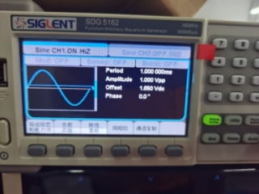

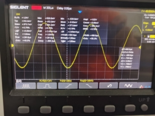

**方波：**

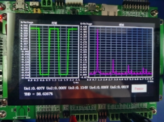

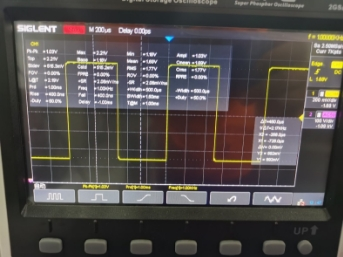

**三角波：**

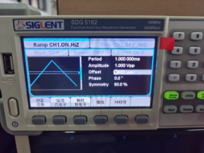

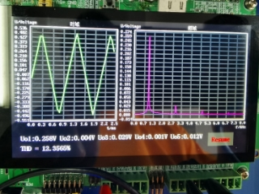

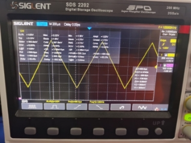

**和硬件同学的联调：**

**总连接图：**

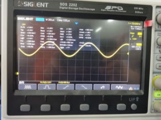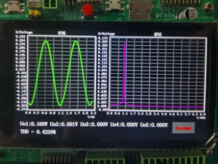

**上图为无失真波形，其总谐波失真值为 0.4229%，输出波形符合实验要求。**

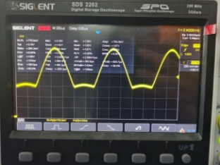

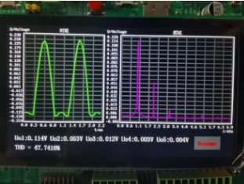

**上图为下失真波形，其总谐波失真值为 47.7418%，输出波形符合实验要求。**

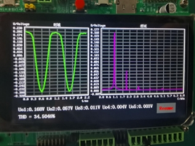

**上图为上失真波形，其总谐波失真值为 34.5046%，输出波形符合实验要求。**

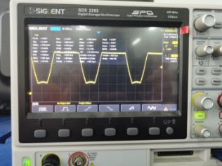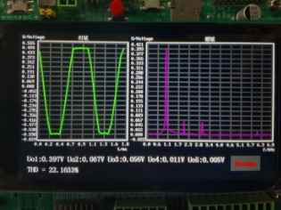

**上图为双边失真波形，其总谐波失真值为 22.1633%，输出波形符合实验要求。**

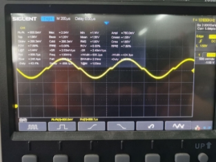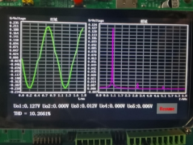

**上图为交越失真波形，其总谐波失真值为 10.2661%，输出波形符合实验要求。**

**五．自学内容**

Bresenham画线

FFT

**六．项目总结**

本项目实现了一种放大器的非线性失真研究装置，从底层绘制线段开始实现了 坐标系的可视化系统实现了信号波形与频谱的绘制。

本学期学习了大量的stm32开发基础，从配置环境，流水点小灯开始，到定时器，pwm，AD，DA等特殊功能实现，一方面巩固了我的C语言基础，另一方面使我对于单片机的底层运作有了更为透彻的认知，可谓收益良多。工程项目相较于其它专业课程，以项目设计为主的理念我非常喜欢，本人相较于作业与考试更偏好项目设计应用。个人认为只有能将知识应用于项目中才算是真的学会了这样的知识，工程教育共计5个项目一份策划，使本学期的生活非常充实（不过这学期有6门课有课程项目导致期末非常肝）。总之非常感谢一学期以来老师的指导，谢谢！

**七．参考文献**

[1] Bresenham, Jack E. "Algorithm for computer control of a digital plotter." IBM Systems journal 4.1 (1965): 25-30.

[2] Green, Chris. "Improved alpha-tested magnification for vector textures and special effects." ACM SIGGRAPH 2007 courses. ACM, 2007.

